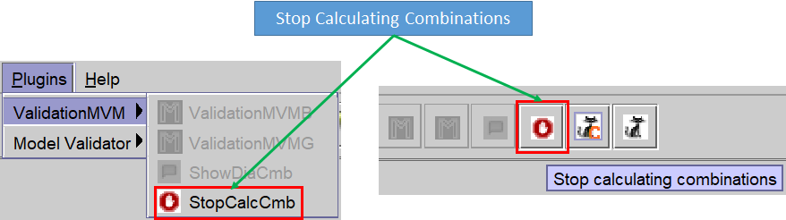

# _MVM (Model Validator Mixer)_


## Table of Contents

- [Introduction](#introduction)
  - [MVM – Overview](#mvm--overview)
- [Instructions for installation for testing](#instructions-for-installation-for-testing)
- [Strategy](#strategy)
  - [Consistency Check](#consistency-check)
  - [Diagnosis](#diagnosis)
  - [Validation](#validation)
  - [Guided Interactive Repair](#guided-interactive-repair)
- [ACKNOWLEDGMENT](#acknowledgment)
- [CITATION](#citation)
- [REFERENCES](#references)


# Introduction

This project is a extension of the **USE** Model Validator plug-in from Martin Gogolla, Fabian Büttner, and Mark Richters 
for the UML-Based Specification Environment (https://sourceforge.net/projects/useocl/). The code is developed in Java.

[(Up)](#Table-of-Contents)

## MVM – Overview
MVM is the tool that supports our detection, validation, and repair strategy proposed in the following works:
- Tool for Debugging Unsatisfiable Integrity Constraints in UML/OCL Class Diagrams (EMMSAD 2020)
- Interactive Repair of Inconsistencies (ER 2025)
- Interactive Repair in Conceptual Models Using LLM

As a strategy, MVM could have been implemented in various programming languages. However, since we decided to use the USE tool as a starting point, MVM is developed in Java and implemented as an extension of USE.

This approach allows MVM to:
- Reuse many of the standard functionalities provided by USE
- Extend the environment with additional capabilities
- Leverage the robust and well‑established ecosystem of the USE tool


Author: ***Juan Antonio Gómez Gutiérrez(2025)***

[(Up)](#Table-of-Contents)

----

# Instructions for installation for testing

To download and use MVM, simply follow these steps:
1. Download the zip file from the following link:

https://drive.google.com/file/d/1w6wcO8XAaGcZxgyI_BUNQxnjqLepJOwL/view?usp=sharing

2. Have Java 11 (or higher) installed. If you don't have it, download it from the following link:
https://adoptium.net/es/temurin/releases?version=11

3. Define the OPENAI_API_KEY environment variable with the key that allows the use of OpenAI. For example, open a CMD session and enter the following (each user has their own key):
```
**setx OPENAI_API_KEY sk-proj-------xxxxxxxxx---------K-NOFAoA**
```
Once you've downloaded the zip file to any folder, extract it and then simply run **RUN** (or RUN nameFile)  bat from the extracted folder.
If everything goes well, you should see the following:


[(Up)](#Table-of-Contents)

# Strategy
Our strategy includes the following sections:

## Consistency Check  
Determine if a UML/OCL diagram is consistent.

## Diagnosis  
Identify the unsatisfactory core, the minimum subsets of constraints involved in the inconsistency, as well as example instances that satisfy the maximum number of constraints in the model.

## Validation  
Create, visualize, and modify instances using a graphical user interface, and evaluate the validity of model constraints in the context of that instance.

## Guided Interactive Repair  
Propose possible solutions to identified inconsistencies—both graphical constraints in the class diagram (such as multiplicities) and textual constraints (such as OCL invariants).
Evaluate the suitability of such candidate solutions and allow reversing previous decisions if they are deemed inadequate.

In addition to determining whether a model is satisfactory or not, the intention is to indicate which elements cause unsatisfactoriness and propose alternatives for their repair, including the possibility of creating instances that demonstrate the viability of the model.

# MVM TOOL
Search for MUS/MSS
The first functionality that MVM provided was the search for **MUS (Minimum Unsatisfiable Core)** and **MSS (Maximum Satisfiable Subset)**.
To achieve this, MVM constructs all possible combinations between the invariants of the model and, relying on the Solver used by USE (kodkodSolver), generates lists containing groups of satisfiable and unsatisfiable invariants.

The calculation of **MUS/MSS** can be performed in two ways:
- **Brute force method**:  Searches all combinations before presenting any results.
- **Greedy method**: Finds an initial group of invariants that are not related to each other and provides a result immediately, allowing the user to begin working while the system continues processing the remaining combinations in the background.

Both methods are available in the menu or toolbar.


## Brute force
When this option is executed, the search for all combinations between invariants is launched in order to internally build the lists of groups of satisfactory and unsatisfactory combinations.
Depending on the number of existing invariants, this search may take a considerable amount of time.

If the user wishes, they can stop this search by clicking on the **Stop calculating combinations** icon:



If you click on this option, a message will appear requesting confirmation:


When the search for combinations is complete, a dialog box appears containing the following tabs:
- **Errors**: Displays groups of combinations that fail when active. Any set of joins that includes any of the groups shown in this tab will produce an unsatisfactory instance.
- **Best approximate solutions**: Shows the groups of combinations that can be active simultaneously and that would produce a satisfactory instance.
- **Statistics**: Provides statistical information such as:
  - total time required to compute all combinations
  - number of calls to the Solver
  - number of satisfactory and unsatisfactory combinations

In the title of the dialog box, you can see the selected method (Brute) and the name of the model being analyzed (Animals).


### Errors
<!--  -->


On this screen we can see different blocks that interact with each other so that, when we click on a row in the Faulty combinations panel, the rest of the blocks are synchronized and show the detail associated with the selected group.

**_Panels_**

- **Faulty combinations**: In this example, we can see that 3 groups of **MUS**  (**6**, **4-8** and **5-8**) have been detected. If we click on the first group (it contains the invariant **'6'**), we will see that the panel on the right shows the selected combination **'6'** as the title and inside it a line for each invariant of that combination.
-	**'6'**: panel showing all the invariants that make up the selected MUS group (**'6'**). When you select a line from this block, the **instances without inv** and **OCL for inv Example panes** synchronize by displaying information associated with the invariant of the selected line.
-	**Example of instances without inv: '6'**: proposes satisfactory combinations that do not contain the  selected **MUS** group  and that can generate a satisfactory instance by simply double-clicking on any of its lines (e.g. **'1-2-3-4-5-7'**).
-	**OCL for inv: '6'**: Displays the definition of the selected invariant to have a view of the possible problem to be solved. In this example it is clear that age cannot be simultaneously **<=0 and >99**.

The **Close** button closes the dialog box and returns to the previous screen.

### Best approximate solutions


In this tab, we can see the groups of joins that can generate satisfactory instances as long as the rest of the invariants that do not appear are disabled. Note that the groups are ordered from the highest number of satisfactory invariants to the least. 

**_Panels_**

The blocks that make up this tab are:
- **Invariants**: Groups of invariants that generate a satisfactory instance. Similar to the one described in **Errors**, if we double-click on any line of the Invariants block, an instance is created and an object diagram opens showing it.
-	**'1-2-3-4-5-7'**: shows the invariants that make up the group with their name.
-	**OCL for inv: 1-Person::valildGreaterThanAge**: Displays the bodyexpression of the invariant selected in the previous block.

### Statistics


**_Panels_**

It displays the following information:
-	**Execution time**: The time it takes for the process to complete.
-	**Number of calls to the solver**: number of calls that are actually made to the solver.
-	**Number of satisfied calls**: solver calls that are satisfactory.
-	**Number of unsatisfied calls**: Calls to the solver that are unsatisfactory.
-	**Total number of combinations**: Total number of combinations. 
-	**Total number of satisfiable combinations**: number of total satisfactory combinations.
-	**Total number of combinations unsatisfiable**: number of total unsatisfactory combinations.

## Greedy

Similar to **Brute force**, the **Greedy method** also searches for **MUS** and **MSS**, but it does so in 2 phases:
-	**Look for a first result with satisfactory invariants**.
-	**Look for the rest of the pending combinations**.

In the first phase, **Greedy** determines the dependence of each invariant on the others by analyzing attributes and classes involved in it and fabricates a collection of invariants that do not interfere with each other. In this way, almost instantaneously we obtain a first result with which to produce a satisfactory instance. 

The second phase looks for the rest of the pending combinations until all the possible ones are completed.

Regarding the dialog box shown during the search, it should be noted that when Greedy gives the first result, in the title of the dialog, in addition to the Greedy method,  the word Initial is also shown  indicating that it is the first result. When the Greedy combination search is complete, End is displayed.


## Creación diagrama desde diálogo MUS/MSS

To create an object diagram, simply double-click on one of the combinations shown in the Errors tab  or in Best approximate solutions:


-------------

# ACKNOWLEDGMENT
Special thanks to ***Robert Clarisó*** for his invaluable help and perseverance and to ***Jordi Cabot*** for his many advices and very important suggestions.

# CITATION

Juan Antonio Gómez-Gutiérrez, Robert Clarisó.
Interactive Repair of Inconsistencies in Conceptual Models. 
In Proc. 44th International Conference on Conceptual Modeling (ER'2025). Lecture Notes in Computer Science, to appear, Springer.

https://link.springer.com/chapter/10.1007/978-3-032-08623-5_1

Juan Antonio Gómez-Gutiérrez, Robert Clarisó, Jordi Cabot.
A Tool for Debugging Unsatisfiable Integrity Constraints in UML/OCL Class Diagrams.
In Proc. 27th International Working Conference on Exploring Modeling Methods for Systems Analysis and Development (EMMSAD’2022). Lecture Notes in Business Information Processing vol. 450, pp. 267–275, Springer.

https://link.springer.com/chapter/10.1007/978-3-031-07475-2_18

   
# REFERENCES

* **Eclipse** - https://www.eclipse.org/downloads/
* **GitHub**  - https://desktop.github.com/
* **USE**     - https://github.com/useocl/use/

[(Up)](#Table-of-Contents)
