# _MVM (Model Validator Mixer)_

<p align="center">
  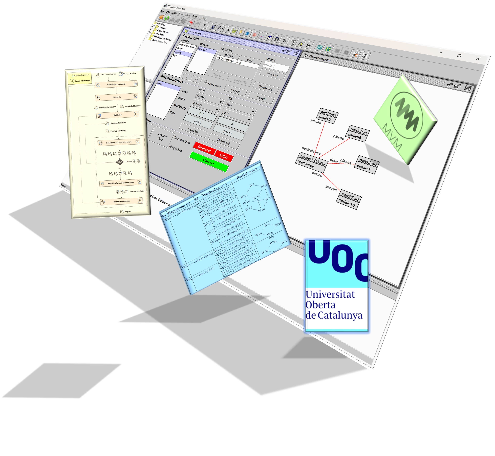
</p>


# Table of Contents

<details>
  <summary><a href="#introduction">📘 Introduction</a></summary>
	
  📄 [MVM – Overview](#mvm--overview)
  
</details>

<details>
  <summary><a href="#instructions-for-installation-for-testing">🛠️ Instructions for installation for testing</a></summary>

  🛠️ [Instructions for installation for testing](#instructions-for-installation-for-testing)

</details>

<details>
  <summary><a href="#strategy">🧩 Strategy</a></summary>

  🔎 [Consistency Check](#consistency-check)  
  🧪 [Diagnosis](#diagnosis)  
  ✔️ [Validation](#validation)  
  🧭 [Guided Interactive Repair](#guided-interactive-repair)

</details>

<details>
  <summary><a href="#mvm-tool">🧰 MVM TOOL</a></summary>

  ⚙️ [Brute force](#brute-force)  
  ❗ [Errors](#errors)  
  🎯 [Best approximate solutions](#best-approximate-solutions)  
  📊 [Statistics](#statistics)  
  ⚡ [Greedy](#greedy)  
  🧱 [Creación diagrama desde diálogo MUS/MSS](#creación-diagrama-desde-diálogo-musmss)

</details>

<details>
  <summary><a href="#mvm-wizard">🧙‍♂️ MVM Wizard</a></summary>

  🏷️ [1: Classes](#1-classes)  
  🧱 [2: Objects](#2-objects)  
  🧬 [3: Attributes](#3-attributes)  
  🧍 [4: Object](#4-object)  
  ➕ [5: New object](#5-new-object)  
  💾 [6: Save object](#6-save-object)  
  ❌ [7: Cancel object](#7-cancel-object)  
  🗑️ [8: Delete object](#8-delete-object)  
  ➕ [9: +](#9-)  
  🪣 [10: Fill](#10-fill)  
  🗺️ [11: Auto Layout](#11-auto-layout)  
  🔄 [12: Refresh](#12-refresh)  
  🔁 [13: Reset](#13-reset)  
  🔗 [14: Associations](#14-associations)  
  🧭 [15: From Class](#15-from-class)  
  🧭 [16: To Class](#16-to-class)  
  🧍 [17: From Object](#17-from-object)  
  🧍 [18: To Object](#18-to-object)  
  🔢 [19: From multiplicity](#19-from-multiplicity)  
  🔢 [20: To multiplicity](#20-to-multiplicity)  
  🏷️ [21: From Role](#21-from-role)  
  🏷️ [22: To Role](#22-to-role)  
  🔗 [23: Insert link](#23-insert-link)  
  ❌ [24: Delete link](#24-delete-link)  
  🛠️ [25: Actions](#25-actions)  
  💡 [26: Suggest fixes](#26-suggest-fixes)  
  📐 [27: State invariants](#27-state-invariants)  
  📦 [28: OBJs](#28-objs)  
  🔢 [29: Multiplicities](#29-multiplicities)  
  🧮 [30: MSS/MUS](#30-mssmus)

</details>

<details>
  <summary><a href="#mvm-check-objects-satisfiability">🧪 MVM Check Objects Satisfiability</a></summary>

  🔍 [1: Filter Objects](#1-filter-objects)  
  ✔️❌ [2: Incorrect/Correct](#2-incorrectcorrect)  
  🔍 [3: Filter Invariants](#3-filter-invariants)  
  🧱 [4: Objects](#4-objects)  
  📐 [5: Invariants](#5-invariants)  
  🧬 [6: Attributes](#6-attributes)  
  🧩 [7: Current invariant body](#7-current-invariant-body)  
  🔄 [8: Body alternatives](#8-body-alternatives)  
  🔍 [9: Filter Alternatives](#9-filter-alternatives)  
  🆕 [10: New Invariant body - Incorrect/Correct](#10-new-invariant-body---incorrectcorrect)  
  🧪 [11: Test](#11-test)  
  🧩 [13: Body expression](#13-body-expression)  
  📄 [14: Show Source](#14-show-source)  
  🗂️ [15: File Name](#15-file-name)  
  💾 [16: Save file](#16-save-file)  
  ❌ [17: Exit](#17-exit)

</details>

<details>
  <summary><a href="#wizard-association">🔗 Wizard Association</a></summary>

  🔗 [1: Associations](#1-associations)  
  🔗 [2: Links](#2-links)  
  ⚠️ [3: Cause](#3-cause)  
  💬 [4: Full Message](#4-full-message)  
  💡 [5: Proposals](#5-proposals)  
  ✔️ [6: Apply](#6-apply)  
  ❌ [7: Exit](#7-exit)  
  🔢 [Example multiplicities](#example-multiplicities)

</details>

<details>
  <summary><a href="#actions">🧾 Actions</a></summary>

  🗂️ [1: File Name](#1-file-name)  
  📅 [2: Creation Date](#2-creation-date)  
  📅 [3: Mod. Date](#3-mod-date)  
  🧩 [4: Model](#4-model)  
  📄 [5: Source USE File](#5-source-use-file)  
  📝 [6: Description](#6-description)  
  🛠️ [7: Actions](#7-actions)  
  🧱 [8: Objects](#8-objects)  
  🧬 [9: Attributes](#9-attributes)  
  📂 [10: Open actions](#10-open-actions)  
  🔍 [11: Find Actions](#11-find-actions)  
  💾 [12: Save actions](#12-save-actions)  
  📥 [13: Load actions](#13-load-actions)  
  🔗 [14: Links](#14-links)  
  ❌ [15: Exit](#15-exit)

</details>

<details>
  <summary><a href="#suggest-fixes">🛠️ Suggest fixes</a></summary>

  🧩 [Profile](#profile)  
  🧪 [Task](#task)  
  📥 [Inputs](#inputs)  
  📤 [Outputs](#outputs)  
  📝 [Remarks](#remarks)

</details>

<details>
  <summary><a href="#ui--suggest-fixes">🖥️ (UI – Suggest fixes)</a></summary>

  🧱 [1: Objects](#1-objects)  
  🔍 [2: Show Diff Objects](#2-show-diff-objects)  
  🔗 [3: Links](#3-links)  
  🔍 [4: Show Diff Links](#4-show-diff-links)  
  🏗️ [5: Create Objects + Links](#5-create-objects--links)  
  ⚙️ [6: Properties](#6-properties)  
  📝 [7: Proposed changes](#7-proposed-changes)  
  🛠️ [8: Show options](#8-show-options)  
  ❌ [9: Exit](#9-exit)
</details>

- 🙏 [ACKNOWLEDGMENT](#acknowledgment)
- 📚 [CITATION](#citation)
- 📖 [REFERENCES](#references)


# Introduction

This project is a extension of the **USE** Model Validator plug-in from Martin Gogolla, Fabian Büttner, and Mark Richters 
for the UML-Based Specification Environment (https://sourceforge.net/projects/useocl/). The code is developed in Java.

[(Up)](#Table-of-Contents)

## MVM – Overview

<p align="center">
  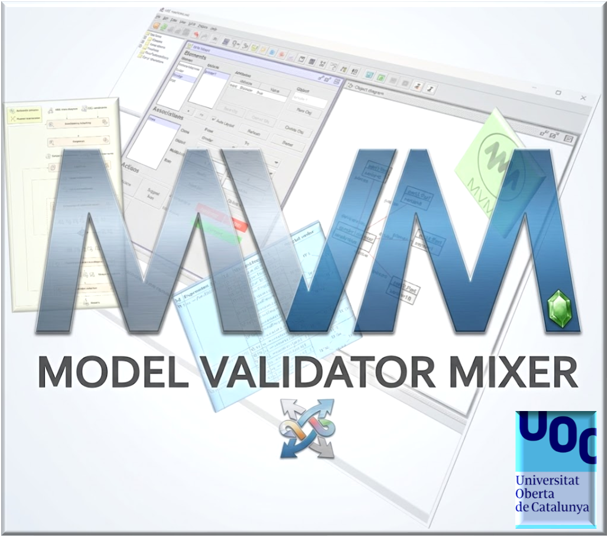<br>
</p>


**MVM** is the tool that supports our **detection**, **validation**, and **repair strategy** proposed in the following works:
- Tool for Debugging Unsatisfiable Integrity Constraints in UML/OCL Class Diagrams (**EMMSAD 2020**)
- Interactive Repair of Inconsistencies (**ER 2025**)
- Interactive Repair in Conceptual Models Using LLM

As a strategy, MVM could have been implemented in various programming languages. However, since we decided to use the USE tool as a starting point, MVM is developed in Java and implemented as an extension of USE.

This approach allows MVM to:
- Reuse many of the standard functionalities provided by USE
- Extend the environment with additional capabilities
- Leverage the robust and well‑established ecosystem of the USE tool


Author: ***Juan Antonio Gómez Gutiérrez (2025)***

[(Up)](#Table-of-Contents)

----

# Instructions for installation for testing

To download and use MVM, simply follow these steps:
1. **Download** the **zip** file from the following link:

https://drive.google.com/file/d/1w6wcO8XAaGcZxgyI_BUNQxnjqLepJOwL/view?usp=sharing

2. Have **Java 11** (or higher) installed. If you don't have it, download it from the following link:
https://adoptium.net/es/temurin/releases?version=11

3. Define the **OPENAI_API_KEY** environment variable with the key that allows the use of OpenAI. For example, open a CMD session and enter the following (each user has their own key):
```
setx OPENAI_API_KEY sk-proj-------xxxxxxxxx---------K-NOFAoA
```
Once you've downloaded the zip file to any folder, extract it and then simply run **RUN** (or **RUN nameFile**)  bat from the extracted folder.
If everything goes well, you should see the following:

<p align="center">
  
  	
</p>


[(Up)](#Table-of-Contents)

# Strategy
Our strategy includes the following sections:

## Consistency Check  
**Determine** if a UML/OCL diagram is **consistent**.

## Diagnosis  
**Identify the unsatisfactory core**, the minimum subsets of constraints involved in the inconsistency, as well as example instances that satisfy the maximum number of constraints in the model.

## Validation  
**Create**, **visualize**, and **modify** **instances** using a graphical user interface, and evaluate the validity of model constraints in the context of that instance.

## Guided Interactive Repair  
Propose possible solutions to identified inconsistencies—both graphical constraints in the class diagram (such as multiplicities) and textual constraints (such as OCL invariants).
Evaluate the suitability of such candidate solutions and allow reversing previous decisions if they are deemed inadequate.

In addition to determining whether a model is satisfactory or not, the intention is to indicate which elements cause unsatisfactoriness and propose alternatives for their repair, including the possibility of creating instances that demonstrate the viability of the model.

[(Up)](#Table-of-Contents)

# MVM TOOL
Search for MUS/MSS
The first functionality that MVM provided was the search for **MUS (Minimum Unsatisfiable Core)** and **MSS (Maximum Satisfiable Subset)**.
To achieve this, MVM constructs all possible combinations between the invariants of the model and, relying on the Solver used by USE (kodkodSolver), generates lists containing groups of satisfiable and unsatisfiable invariants.

The calculation of **MUS/MSS** can be performed in two ways:
- **Brute force method**:  Searches all combinations before presenting any results.
- **Greedy method**: Finds an initial group of invariants that are not related to each other and provides a result immediately, allowing the user to begin working while the system continues processing the remaining combinations in the background.

Both methods are available in the menu or toolbar.


<p align="center">
   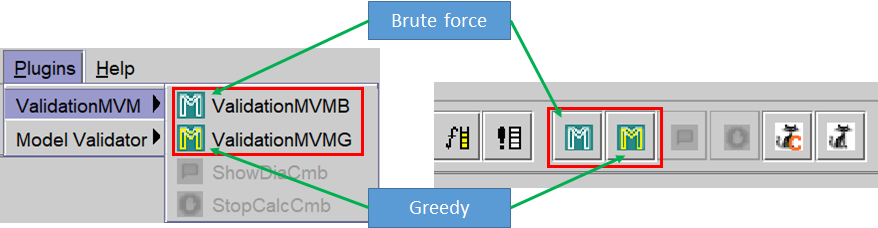
</p>

## Brute force
When this option is executed, the search for all combinations between invariants is launched in order to internally build the lists of groups of satisfactory and unsatisfactory combinations.
Depending on the number of existing invariants, this search may take a considerable amount of time.

If the user wishes, they can stop this search by clicking on the **Stop calculating combinations** icon:

<p align="center">
   
</p>

If you click on this option, a message will appear requesting confirmation:

<p align="center">
   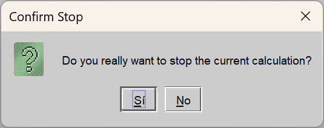
</p>

When the search for combinations is complete, a dialog box appears containing the following tabs:
- **Errors**: Displays groups of combinations that fail when active. Any set of joins that includes any of the groups shown in this tab will produce an unsatisfactory instance.
- **Best approximate solutions**: Shows the groups of combinations that can be active simultaneously and that would produce a satisfactory instance.
- **Statistics**: Provides statistical information such as:
  - total time required to compute all combinations
  - number of calls to the Solver
  - number of satisfactory and unsatisfactory combinations

In the title of the dialog box, you can see the selected method (Brute) and the name of the model being analyzed (Animals).

[(Up)](#Table-of-Contents)

### Errors
<!-- 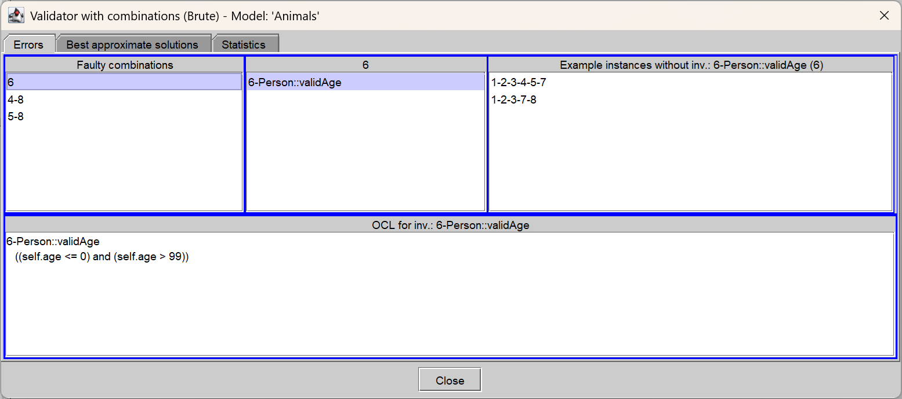 -->


On this screen we can see different blocks that interact with each other so that, when we click on a row in the Faulty combinations panel, the rest of the blocks are synchronized and show the detail associated with the selected group.

**_Panels_**

- **Faulty combinations**: In this example, we can see that 3 groups of **MUS**  (**6**, **4-8** and **5-8**) have been detected. If we click on the first group (it contains the invariant **'6'**), we will see that the panel on the right shows the selected combination **'6'** as the title and inside it a line for each invariant of that combination.
-	**'6'**: panel showing all the invariants that make up the selected MUS group (**'6'**). When you select a line from this block, the **instances without inv** and **OCL for inv Example panes** synchronize by displaying information associated with the invariant of the selected line.
-	**Example of instances without inv: '6'**: proposes satisfactory combinations that do not contain the  selected **MUS** group  and that can generate a satisfactory instance by simply double-clicking on any of its lines (e.g. **'1-2-3-4-5-7'**).
-	**OCL for inv: '6'**: Displays the definition of the selected invariant to have a view of the possible problem to be solved. In this example it is clear that age cannot be simultaneously **<=0 and >99**.

The **Close** button closes the dialog box and returns to the previous screen.

[(Up)](#Table-of-Contents)

### Best approximate solutions
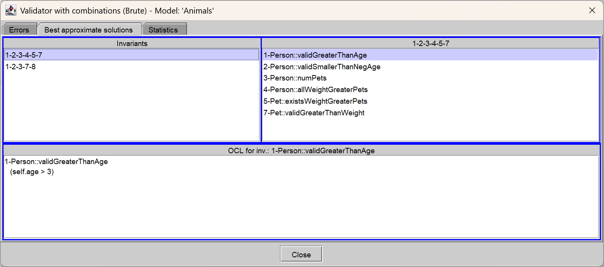

In this tab, we can see the groups of joins that can generate satisfactory instances as long as the rest of the invariants that do not appear are disabled. Note that the groups are ordered from the highest number of satisfactory invariants to the least. 

**_Panels_**

The blocks that make up this tab are:
- **Invariants**: Groups of invariants that generate a satisfactory instance. Similar to the one described in **Errors**, if we double-click on any line of the Invariants block, an instance is created and an object diagram opens showing it.
-	**'1-2-3-4-5-7'**: shows the invariants that make up the group with their name.
-	**OCL for inv: 1-Person::valildGreaterThanAge**: Displays the bodyexpression of the invariant selected in the previous block.

[(Up)](#Table-of-Contents)

### Statistics
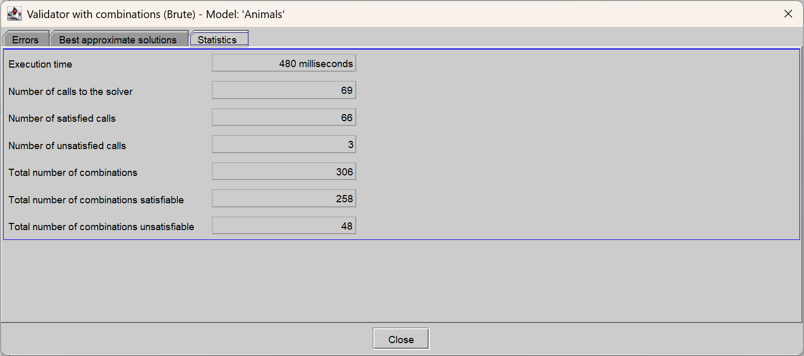

**_Panels_**

It displays the following information:
-	**Execution time**: The time it takes for the process to complete.
-	**Number of calls to the solver**: number of calls that are actually made to the solver.
-	**Number of satisfied calls**: solver calls that are satisfactory.
-	**Number of unsatisfied calls**: Calls to the solver that are unsatisfactory.
-	**Total number of combinations**: Total number of combinations. 
-	**Total number of satisfiable combinations**: number of total satisfactory combinations.
-	**Total number of combinations unsatisfiable**: number of total unsatisfactory combinations.

[(Up)](#Table-of-Contents)

## Greedy

Similar to **Brute force**, the **Greedy method** also searches for **MUS** and **MSS**, but it does so in 2 phases:
-	**Look for a first result with satisfactory invariants**.
-	**Look for the rest of the pending combinations**.

In the first phase, **Greedy** determines the dependence of each invariant on the others by analyzing attributes and classes involved in it and fabricates a collection of invariants that do not interfere with each other. In this way, almost instantaneously we obtain a first result with which to produce a satisfactory instance. 

The second phase looks for the rest of the pending combinations until all the possible ones are completed.

Regarding the dialog box shown during the search, it should be noted that when Greedy gives the first result, in the title of the dialog, in addition to the Greedy method,  the word Initial is also shown  indicating that it is the first result. When the Greedy combination search is complete, End is displayed.

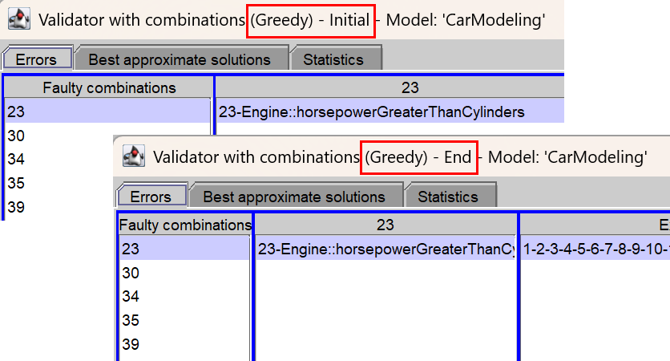

[(Up)](#Table-of-Contents)

## Creación diagrama desde diálogo MUS/MSS

To create an object diagram, simply double-click on one of the combinations shown in the Errors tab  or in **Best approximate solutions**:

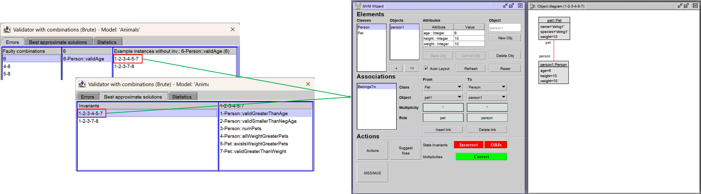

[(Up)](#Table-of-Contents)

# MVM Wizard 
This screen is the main screen from which the vast majority of the functionalities contained in MVM can be used or accessed.

It is basically divided into 3 blocks:
-	**Elements**: Manages existing objects in the current instance (additions, deletions, modifications, and queries)
-	**Associations**: Manage existing links between objects
-	**Actions**: access the utilities for repairing invariants, multiplicities, log of actions performed and consult OpenAI.

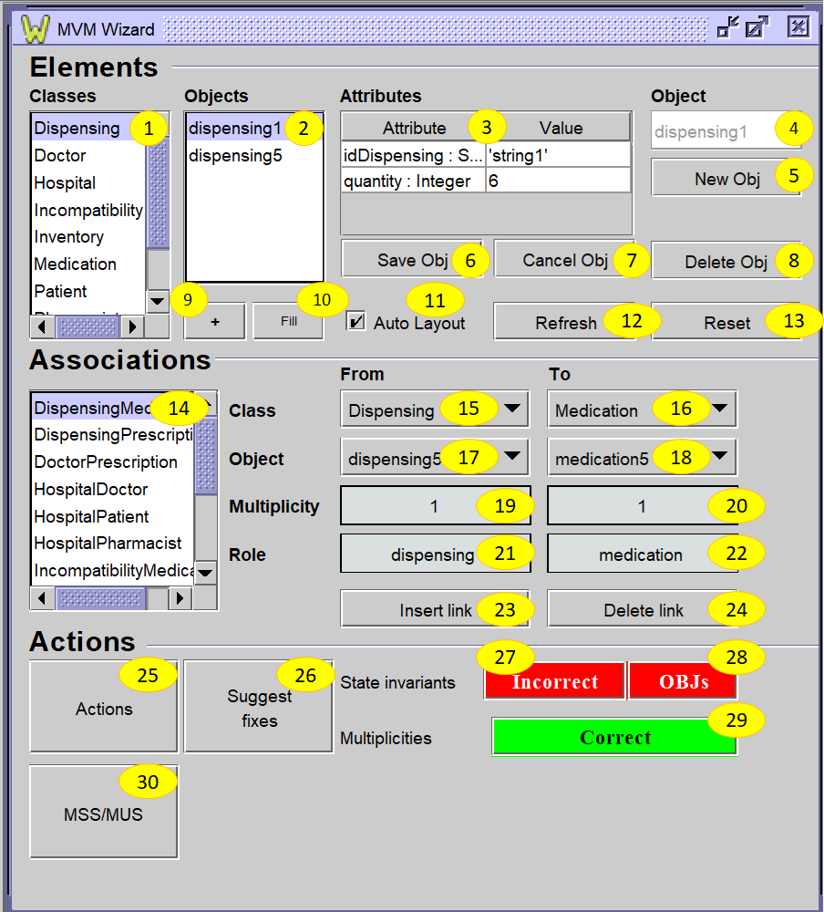

Below, we detail the purpose of each graphic element.

## 1: Classes
Displays the existing classes in the model. When you click on a class, the **Objects** and **Attributes** blocks synchronize to show the existing objects of the selected class and the attributes and their values of the first object of that class.

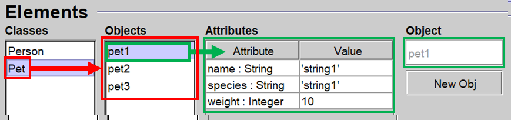

[(Up)](#Table-of-Contents)

## 2: Objects
Displays the existing objects in the current instance of the class selected in the **Classes** block. Each time an object is selected, the **Attributes table** displays its corresponding attributes and values.

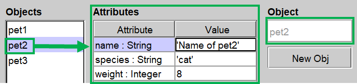

[(Up)](#Table-of-Contents)

## 3: Attributes
It allows you to visualize and modify the attributes and values of an object. In the case of an existing object, you can modify a value by selecting it and then clicking on the value you want to modify.

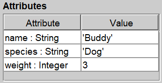

The values assigned to the attributes of type String must be enclosed in single quotation marks ('**Example String**').

When a value is modified, the **Save Obj** and **Cancel Obj** buttons are enabled  to make the changes permanent or leave the object as it was without changing anything respectively.

If you enter a value that does not correspond to the expected type, an error message appears:

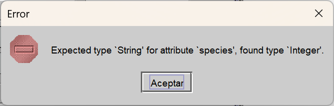

[(Up)](#Table-of-Contents)


## 4: Object

This text box is used to display the **ID** of the object that has the focus and is disabled when the treated object already exists. However, when we click on the **New Obj** button, it is enabled so that we can enter a new **ID**:

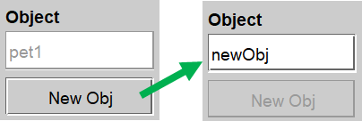

If we enter an **ID** that already exists and click on **Save Obj**, an error message appears:

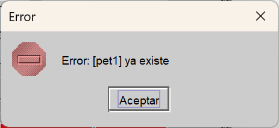

If we want to leave the object as it was before changing anything, we will simply press **Cancel Obj**.

[(Up)](#Table-of-Contents)

## 5: New object

Pressing this button enables the Object text box  to enter an **ID** and leaves the values in the attributes so that we can modify only those that are necessary.

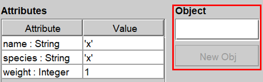

[(Up)](#Table-of-Contents)

## 6: Save object

[(Up)](#Table-of-Contents)

Applies to the instance the modifications made to the object.

[(Up)](#Table-of-Contents)

## 7: Cancel object

Leaves the object with the values it had before you modified it and clicked **Save Obj**.

[(Up)](#Table-of-Contents)

## 8: Delete object

Allows you to delete the selected object, but first requests confirmation with this message:

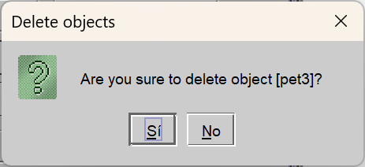

[(Up)](#Table-of-Contents)

## 9: +

Allows you to create an object by copying the selected object. The **object ID** will be the name of the class followed by a number that it will get from a sequential number within the class. 

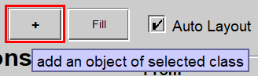

[(Up)](#Table-of-Contents)

## 10: Fill

Create one object of each class. The **object ID** will be the name of the class followed by a number that it will get from a sequential number within the class. 

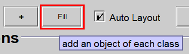

Initialize attributes depending on their type:
-	**String**: ‘x’.
-	**Boolean**: true
-	**Integer**: 1
-	**Real**: 1.0.

[(Up)](#Table-of-Contents)

## 11: Auto Layout

**Enables**/**disables** the feature that automatically places objects on the diagram in a manner spaced apart.	

[(Up)](#Table-of-Contents)

## 12: Refresh

Recreate the elements of the diagram.

[(Up)](#Table-of-Contents)

## 13: Reset

Deletes all objects from the instance and flushes the diagram.

[(Up)](#Table-of-Contents)

## 14: Associations

Lists the associations defined in the model.

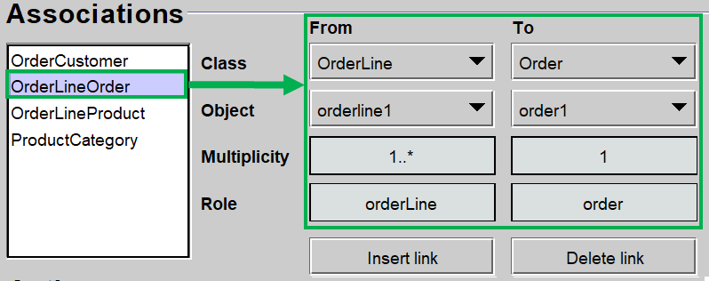

[(Up)](#Table-of-Contents)

Selecting an association synchronizes the '**From**' and '**To**' information on the right.

## 15: From Class
Displays the **participating class** at the origin endpoint.

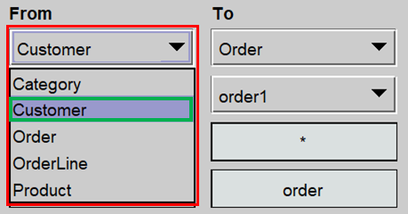

[(Up)](#Table-of-Contents)

## 16: To Class

Displays the **participating class** at the end endpoint.

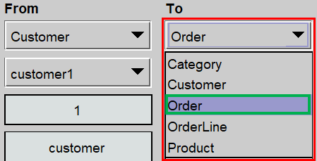

[(Up)](#Table-of-Contents)

## 17: From Object

Displays the **participating object** at the source endpoint.

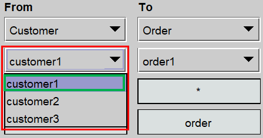

[(Up)](#Table-of-Contents)

## 18: To Object

Displays the **participating object** at the end endpoint.

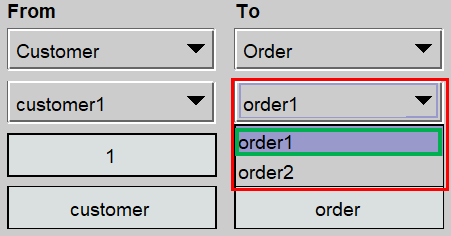

[(Up)](#Table-of-Contents)

## 19: From multiplicity

**Multiplicity** at the **origin** extreme.

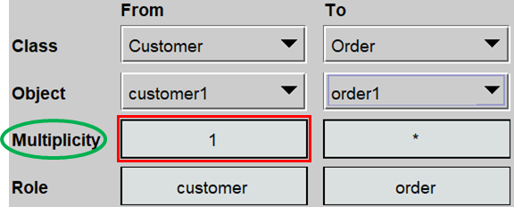

[(Up)](#Table-of-Contents)

## 20: To multiplicity

**Multiplicity** at the **endpoint**.

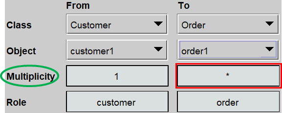

[(Up)](#Table-of-Contents)

## 21: From Role

**Role** on the **origin** endpoint.

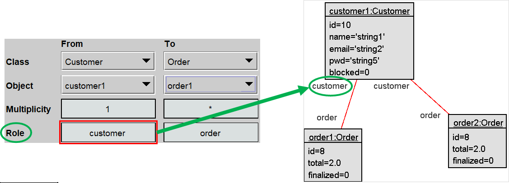

[(Up)](#Table-of-Contents)

## 22: To Role

**Role** at the **end** endpoint.

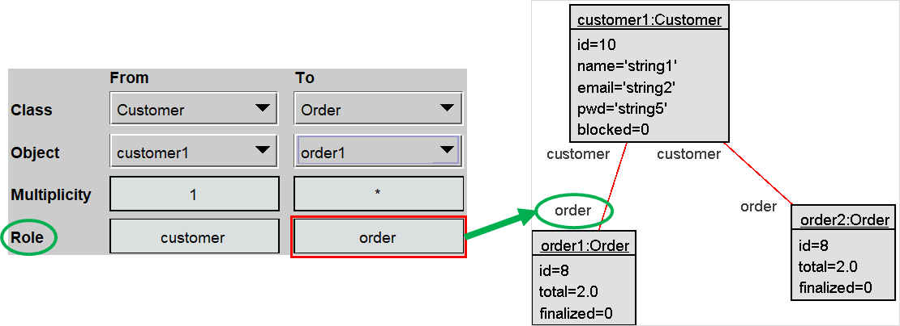

[(Up)](#Table-of-Contents)

## 23: Insert link

It allows you to insert a link between 2 objects. To do this, we have to select the source object and the final object and click on the **Insert Link button**:

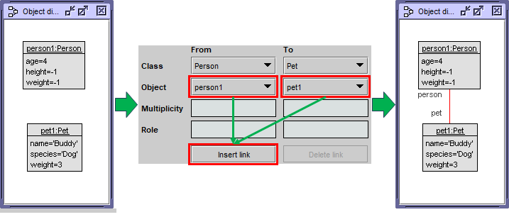

[(Up)](#Table-of-Contents)

## 24: Delete link

Allows you to delete a link between 2 objects. To select a link, we can select the objects that are at each end or click on it in the diagram.

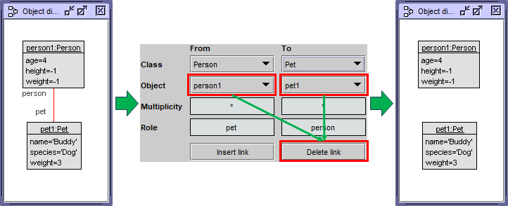

[(Up)](#Table-of-Contents)

## 25: Actions

This button allows access to **MVM Wizard Actions**, which is the functionality in charge of managing the record of the actions carried out on a given instance.

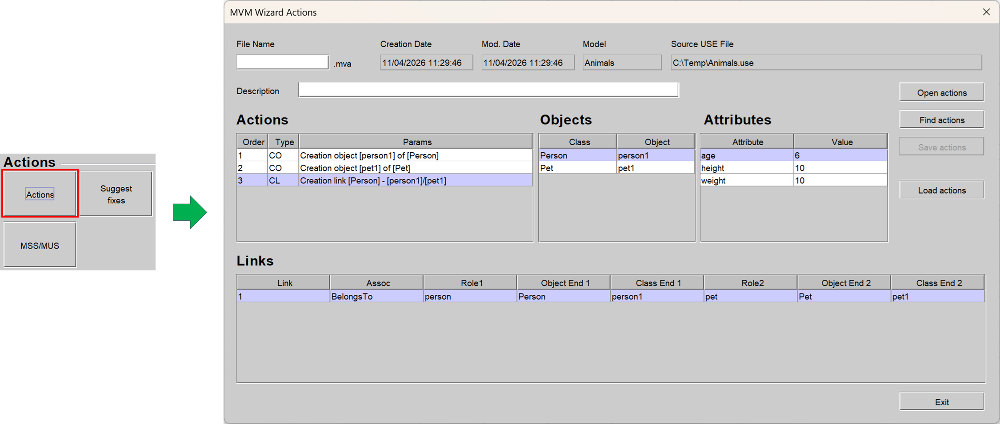

With this functionality, the user will be able to record a set of actions and retrieve them later to reproduce a given situation on the instance. You can even go back to a specific situation without needing to record any files beforehand.

[(Up)](#Table-of-Contents)

## 26: Suggest fixes

This button allows **OpenAI** to be invoked  to perform a query that allows us to get suggestions to detect errors in the model and correct them.

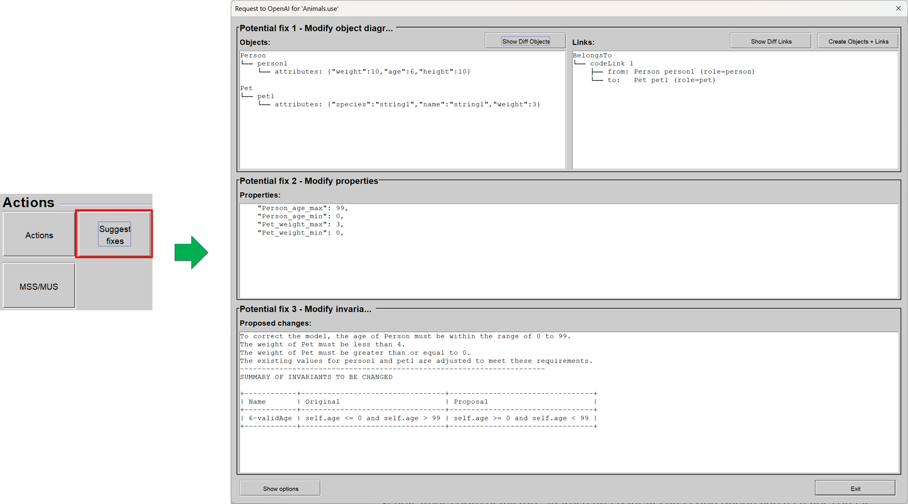

[(Up)](#Table-of-Contents)

## 27: State invariants

This section allows you to review the status of invariants. The color of the button indicates whether all the invariants are met or not so that, at a glance, we can check the status of the instance as far as invariants are concerned.

If we click on it, a screen appears where we can see which invariants are satisfied and which are not.

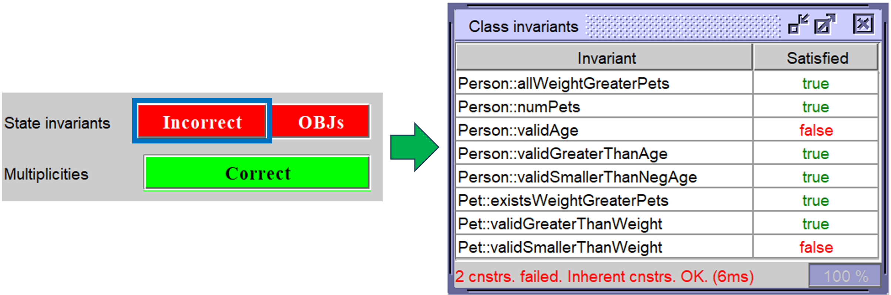

[(Up)](#Table-of-Contents)

## 28: OBJs

This button allows access to the functionality that tells us which invariants are failing according to the existing objects in the instance and which are the alternatives proposed for their solution. The color of the button will depend on whether the invariants are satisfied or not.

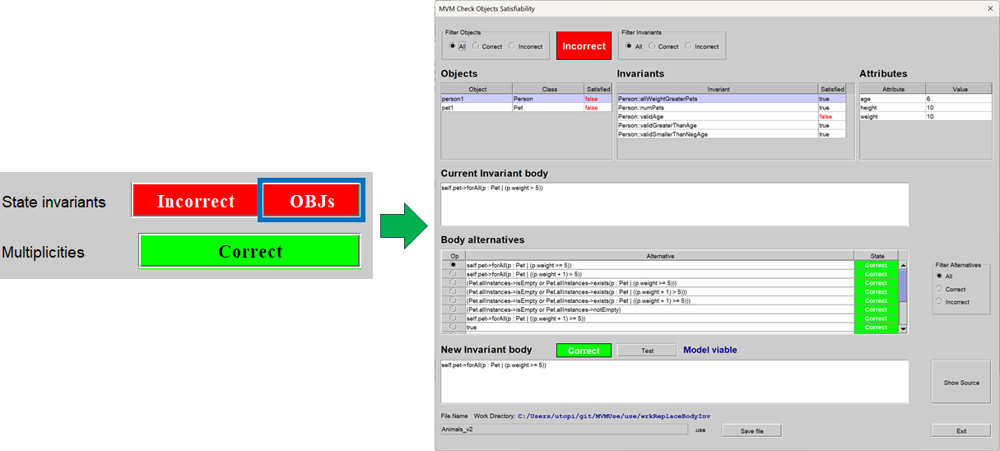

[(Up)](#Table-of-Contents)

## 29: Multiplicities

This button gives access to the screen that determines the multiplicity problems encountered in the current instance and helps to solve them by proposing the **creation**/**deletion** of objects and the creation of links between them.


[(Up)](#Table-of-Contents)

## 30: MSS/MUS

Using this button, if accessible, we can display the dialog box that shows the previously obtained **MUS**/**MSS**. If it is not accessible, it means that they have not yet been calculated. It is equivalent to clicking on the icon that we have in the toolbar:

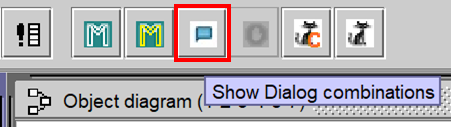

When you click on this option, you will see the dialog associated with the **MUS**/**MSS**:

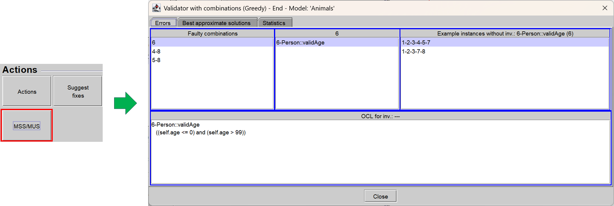

[(Up)](#Table-of-Contents)

# MVM Check Objects Satisfiability

This button also changes color depending on whether the invariants are satisfied or not. Clicking on it gives access to the following** MVM Check Objects** 

**Satisfiability screen**:

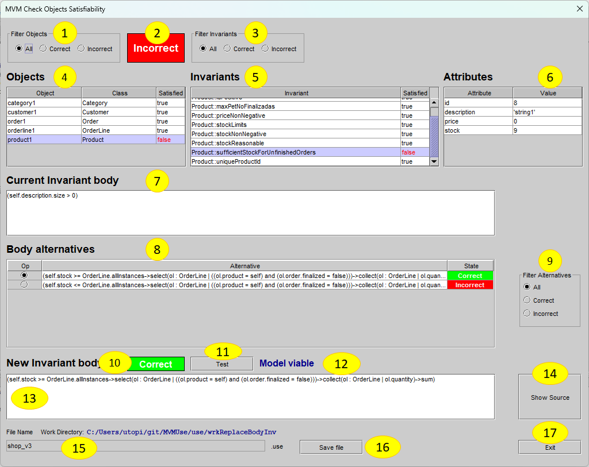

This screen shows the existing objects in the instance and for each object, the invariants in which they participate and also the associated attributes and values. Each time an object is selected, the other blocks are synchronized to display the information associated with it. Therefore, if an object appears as false in the **Satisfied** column, there is surely at least one invariant that is not satisfied for it.

Below, we comment on the graphic elements that make it up.

[(Up)](#Table-of-Contents)

## 1: Filter Objects

This group of options allows you to display objects according to the selected option:

| Vista    | Imagen |
|----------|--------|
| All      | 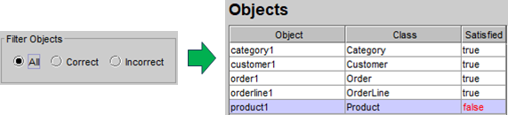 |
| Correct  | 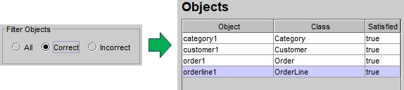 |
| Incorrect| 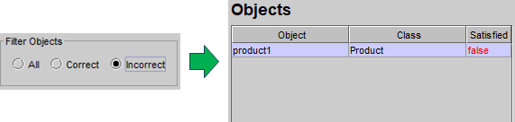 |

[(Up)](#Table-of-Contents)

## 2: Incorrect/Correct

This label shows the general state of the instance so that at a glance it can be easily cataloged:

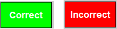

[(Up)](#Table-of-Contents)

## 3: Filter Invariants

When we select an object, the invariant block shows all the invariants in which it participates. In this case, it may be interesting to show them all, or only the correct or incorrect ones.

| Vista    | Imagen |
|----------|--------|
| All      | 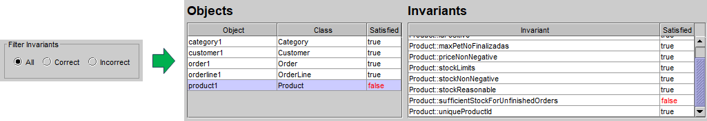 |
| Correct  | 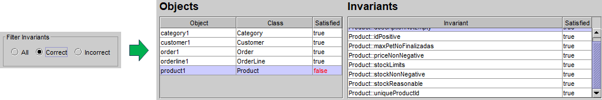 |
| Incorrect| 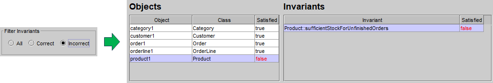 |

[(Up)](#Table-of-Contents)

## 4: Objects

Displays the existing objects on the instance. When clicked, the rest of the blocks are synchronized to show the information associated with it.

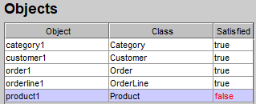

[(Up)](#Table-of-Contents)

## 5: Invariants

Displays the invariants associated with the selected object.

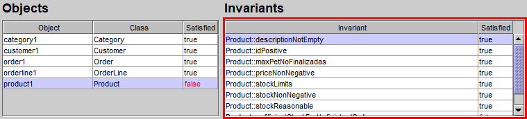

[(Up)](#Table-of-Contents)

## 6: Attributes

Displays the attributes associated with the selected object.

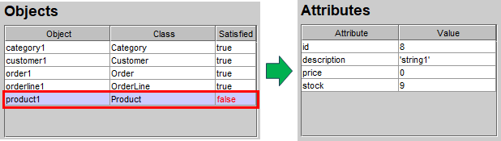

[(Up)](#Table-of-Contents)

## 7: Current invariant body

Displays the bodyexpression currently held by the selected invariant.

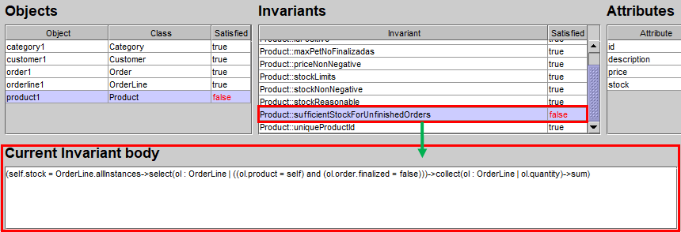

[(Up)](#Table-of-Contents)

## 8: Body alternatives

Displays the alternatives that have been calculated for the selected invariant.

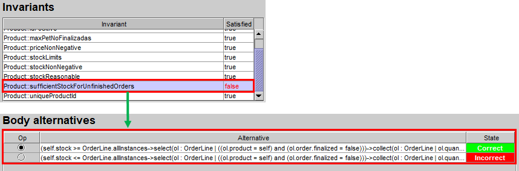

For each of the proposed alternatives, the system calculates its satisfactibility.

[(Up)](#Table-of-Contents)

## 9: Filter Alternatives

It allows you to visualize all the alternatives, only the correct ones or only the wrong ones.

| Vista    | Imagen |
|----------|--------|
| All      | 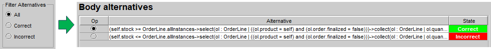 |
| Correct  | 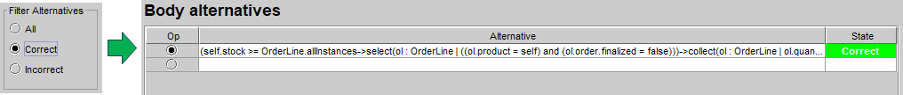 |
| Incorrect| 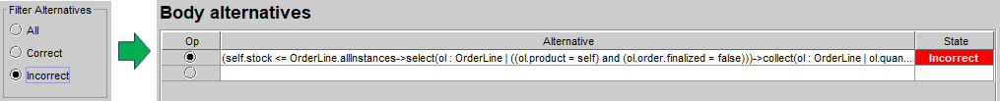 |

[(Up)](#Table-of-Contents)

## 10: New Invariant body - Incorrect/Correct

This label shows the result of the test of the alternative whose definition is found in the text box just below (**13: Body expression**). It can have any of the following values:

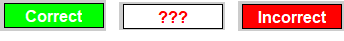

The ‘questions’ are displayed when the text box containing the definition of the bodyexpression receives focus and disappear when it loses it. 

[(Up)](#Table-of-Contents)

## 11: Test

This button allows you to run the test to check that the **bodyexpression** of the alternative in the text box is correct.

[(Up)](#Table-of-Contents)

## 12: Model viable

This text allows you to check whether the model definition has a good syntax or not after the replacement of the new **bodyexpression** over the old one.
Examples:

| Correct | Incorrect |
|--------|-----------|
| 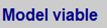 | 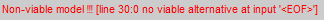 |

[(Up)](#Table-of-Contents)

## 13: Body expression

This text box contains the bodyexpression that will replace the current one in the treated invariant in the new model. When we click on an alternative, the associated expression is placed in this text box. If the user wants, they can modify it manually and that's when questions appear on the label above this text box.

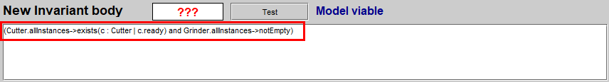

[(Up)](#Table-of-Contents)

## 14: Show Source

It shows a screen with 2 parts: 
-	The **current one**
-	the **new one** as it would be after replacing the invariant with the alternative

This screen looks like this:

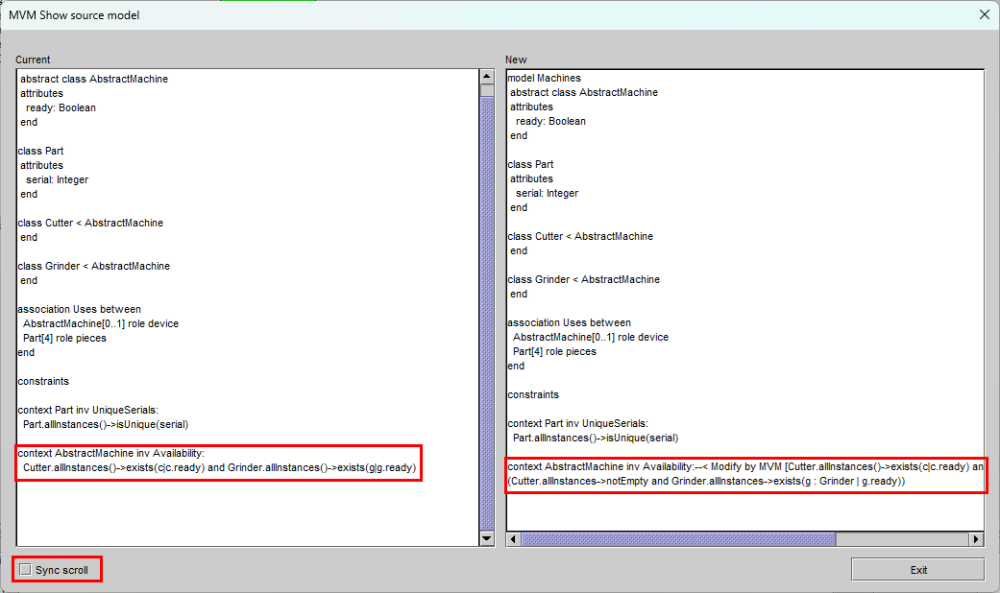

In it you can see the old definition of the invariant **Availability**, and the new one. Note that the old definition is converted to a comment (**--**) for the record, and the new one is added below.

It is possible to synchronize both panels (**Current** and **New**) by activating the **Sync scroll** check.

[(Up)](#Table-of-Contents)

## 15: File Name

Indicate the name of the file to be proposed. The first proposal will be to add the suffix **_vX** with **X** being the version number that already exists. If no version exists, the suffix will be **_v1**. If a previous version exists, such as **_v4**, the proposed version will be **_v5**.

The default target directory will be **wrkReplaceBodyInv** which will be inside the working directory where the application is running.

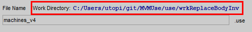

If this directory does not exist, it will be created automatically.
 
[(Up)](#Table-of-Contents)

## 16: Save file

This button allows you to save a file with the new model in which the previously selected invariant has been modified, replacing its definition with the new definition entered in the New invariant body text box.

Clicking on it will open the File to Save dialog proposing the default directory and name, but the user can modify what is necessary according to their criteria:

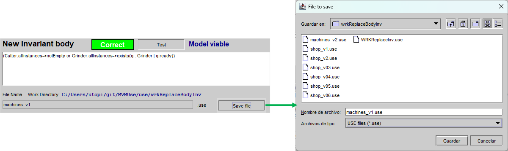

[(Up)](#Table-of-Contents)

## 17: Exit

Allows you to close the screen in progress and return to the previous one.

[(Up)](#Table-of-Contents)


# Wizard Association

This button gives access to the screen that helps solve problems of multiplicity by proposing the creation/deletion of objects and the creation of links between them.

The main screen of this utility is composed of the following graphic elements:

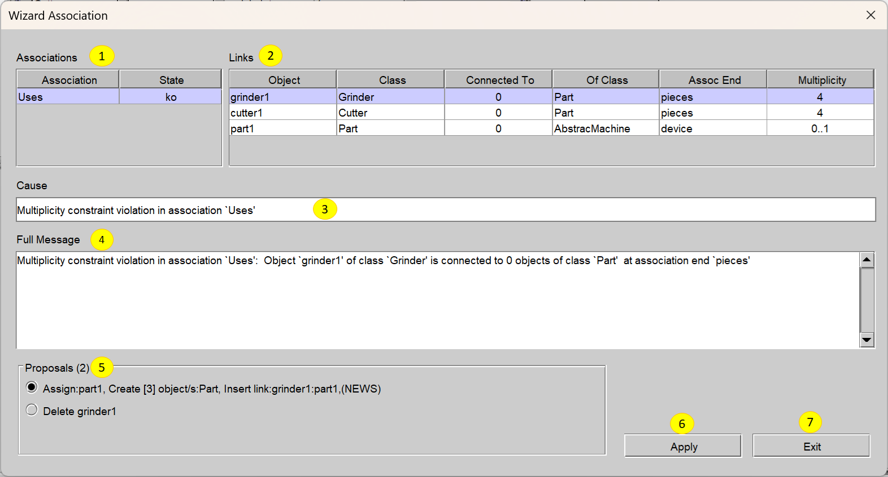

[(Up)](#Table-of-Contents)

## 1: Associations

Displays the list of associations that have a problem. When you click on an association, the rest of the blocks on the screen are synchronized to show the information of the links associated with it.

[(Up)](#Table-of-Contents)

## 2:Links

Displays objects that are potentially related to the selected association. When you click on a link, you will see that the rest of the blocks (except **Associations**) synchronize to show information related to the selected link.

[(Up)](#Table-of-Contents)

## 3: Cause

It shows the **cause** why the link is failing.

[(Up)](#Table-of-Contents)

## 4: Full Message

Displays the **full** error message associated with the selected link. 

[(Up)](#Table-of-Contents)

## 5: Proposals

It shows the proposals envisaged to try to solve the problem of multiplicity.

The proposals that are made are based on the following actions:
-	**Create elements** that help respect the cardinality of links
-	**Assign elements** to create links
-	**Crear links**
-	**Delete Items**

[(Up)](#Table-of-Contents)

## 6: Apply

This button is responsible for applying the selected proposal. Once we click on **Apply** , the dialog closes and the proposed actions are executed.

[(Up)](#Table-of-Contents)

## 7: Exit

Closes the dialog box without taking any action.

[(Up)](#Table-of-Contents)

## Example multiplicities

Suppose we have an instance with an object of each class:

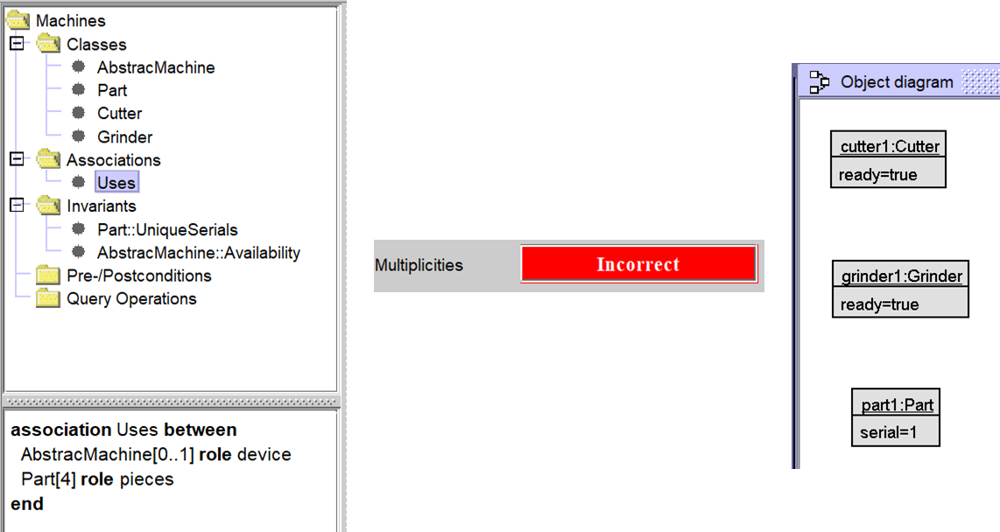

The **AbstractMachine** class is an abstract class that cannot be created directly by an object.

We note that **Multiplicities** is **Incorrect**.

If we click on the **Incorrect** button to access the **Wizard Association** screen, we will see that it indicates that the **grinder1** object is not connected to any **Part** object and therefore the **Uses** association fails.

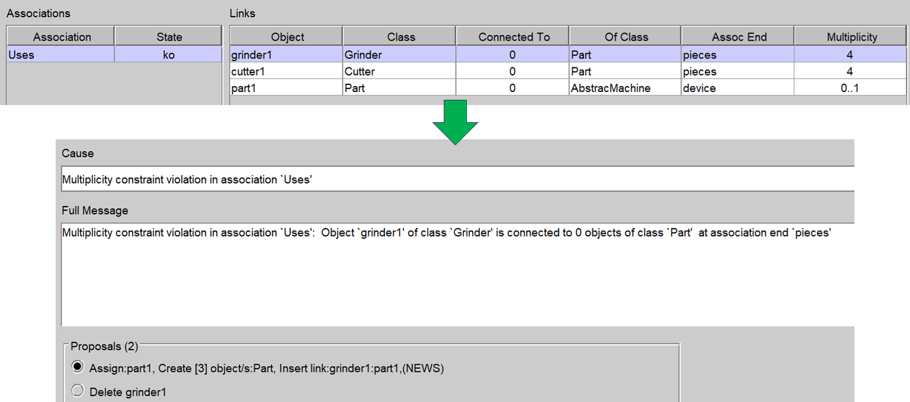

We also see that one of the proposals is to assign **Part1** (since it is not associated), create 3 objects of type **Part** and insert a link between **grinder1**, the **part1** object and the new (**NEWS**) objects that it creates.

If we select this option and click on **Apply**, we will get the following diagram of objects:

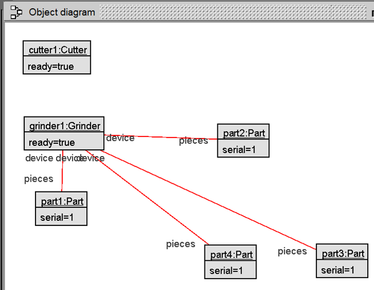

We can see that the topic of multiplicities is still in an Incorrect state.

We can click on that button again to continue with the solution of these multiplicities and we see that there are fewer to solve.

This time, multiplicity fails because the object **cutter1** is not connected properly.

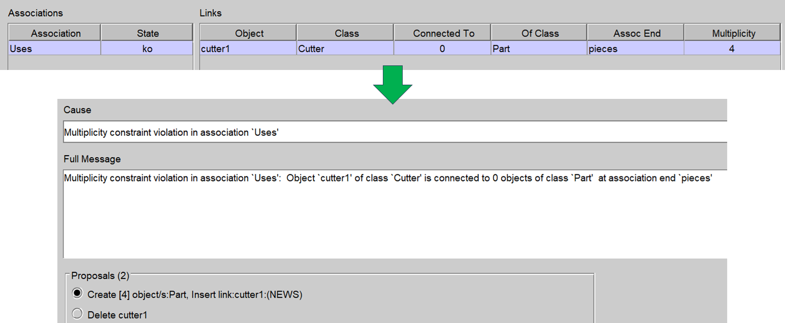

Similar to the previous case, we will accept the creation of **4 objects** of type **Part** and the creation of the link of the same (**NEWS**) with **cutter1**.

Click on **Apply** and we will get the following diagram of objects:

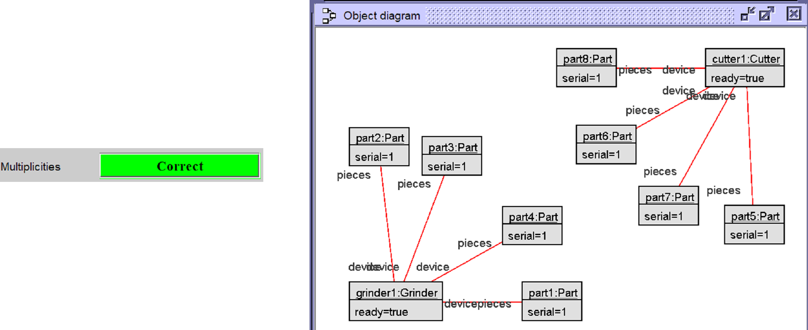

We can see how the problem of multiplicities has already been solved.

# Actions
This button allows access to MVM Wizard Actions. This utility is responsible for managing the record of the actions performed on a given instance. In this way, we can record each action and return to a certain point in the sequence in case we want to undo any of them. It is also possible to store all actions with a name so that you can retrieve it later and replay them all at once instantly.

Next, the main screen is shown and its graphic elements are commented on.

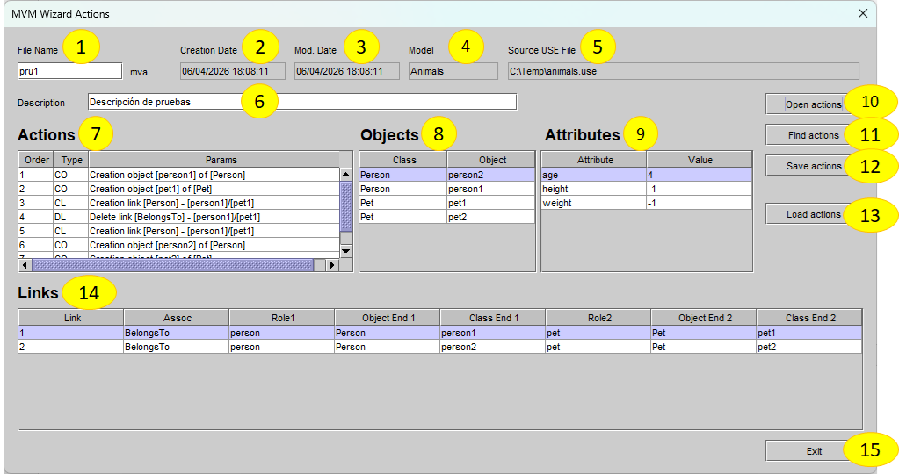

[(Up)](#Table-of-Contents)

## 1: File Name

Name of the file that will store our sequence of actions. This type of file is stored with the .mva extension.

## 2: Creation Date

Date and time of file creation .

## 3: Mod. Date

Date and time of the last modification of the file.

## 4: Model

Model on which the actions have been carried out.

## 5: Source USE File

File used in the MVM session and containing the model on which the actions have been performed.

## 6: Description

Description of the sequence of actions.

[(Up)](#Table-of-Contents)

## 7: Actions

Actions performed on the instance listed in the order they were performed.

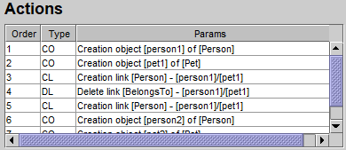

The types of actions are as follows:

| **Abbrev** | **Meaning**            |
|------------|-------------------------|
| **CO**     | Create object           |
| **CL**     | Create link             |
| **DO**     | Delete object           |
| **DL**     | Delete link             |
| **MA**     | Modification object     |

When an action is selected, the **Objects** and **Links** blocks are synchronized to show the objects and links that exist after the action is performed.

We can check the elements that are created by clicking on the first 3 actions:

| **Actions** | **Links** |
|------------|-----------|
| 1 | 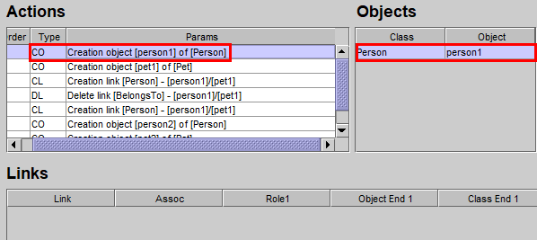 |
| 2 | 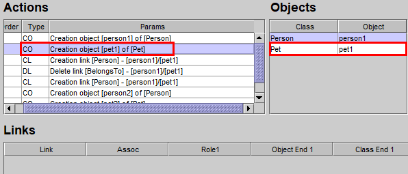 |
| 3 | 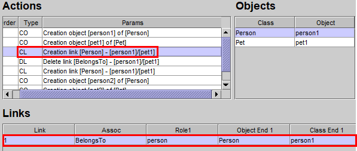 |

[(Up)](#Table-of-Contents)

## 8: Objects

Displays existing objects after the selected action has been performed. When you select an object, the **Attributes block**  displays the values associated with each attribute of the object:

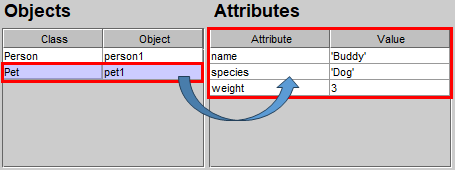

[(Up)](#Table-of-Contents)

## 9: Attributes

Displays the value of each of the attributes of the object that is selected. See figure shown in the previous section (8: Objects).

## 10: Open actions

This button allows you to open a file of sequences of actions.

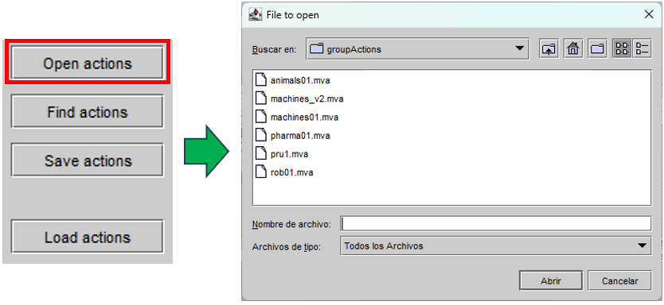

[(Up)](#Table-of-Contents)

## 11: Find Actions

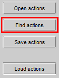

This button allows you to search for files with sequences of actions: 

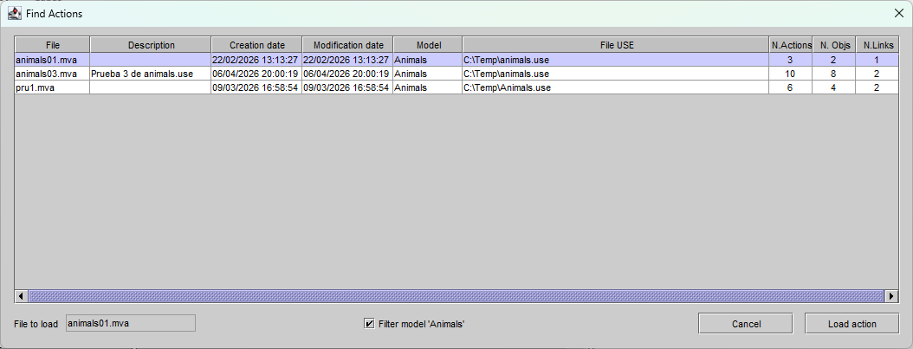

By default, it uses the model’s name to filter the files to be searched, but if we uncheck the **Filter model 'Animals'** check, it shows all the existing files:

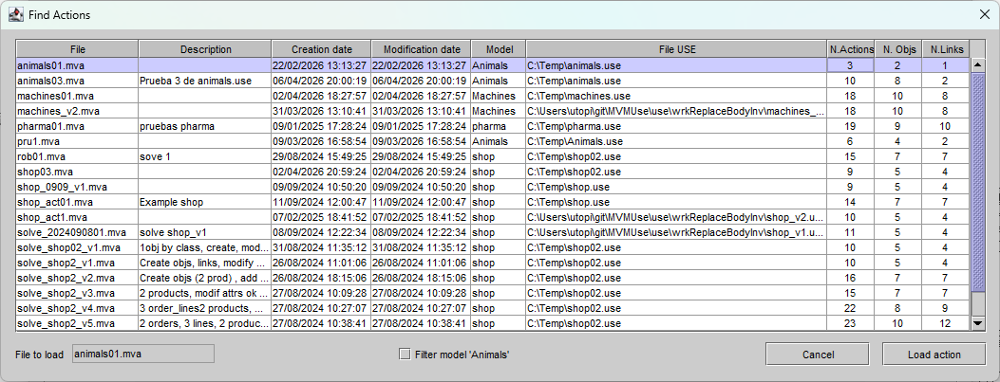

To load a file, just click on the line that contains it and click on the Load action button or double-click on that line.

[(Up)](#Table-of-Contents)

## 12: Save actions

It allows you to save a file with the actions carried out so far on the instance.

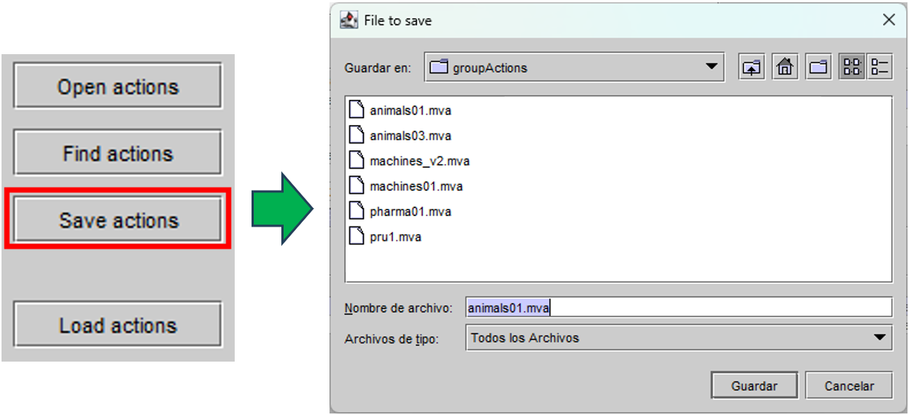

[(Up)](#Table-of-Contents)

## 13: Load actions

This button allows you to create an instance with the elements indicated in the associated action. If a list of actions has for example 10 actions, but we select action 3, only the first 3 actions will be executed. This allows you to roll back the instance's situation to a certain point by undoing all subsequent instances.

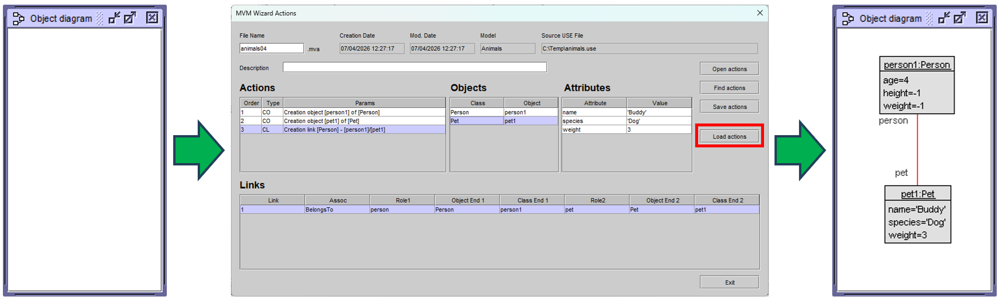

[(Up)](#Table-of-Contents)

## 14: Links

Displays the existing links in the instance after the execution of the selected action.

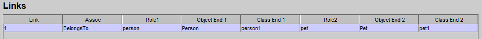

[(Up)](#Table-of-Contents)

## 15: Exit

Closes the dialog box.

[(Up)](#Table-of-Contents)

# Suggest fixes

Using this button, we make a query to OpenAI asking it mainly to help us determine what errors the model may contain and to tell us how we could solve it.

In the consultation we may provide you with certain information such as **INPUT** in case we have already calculated or not the **MUS**/**MSS** previously or we already have a collection of objects and links.

To provide **OpenAI** with the necessary context, the query will be performed with a block of text with the following structure:
-	**PROFILE**: contextualiza a OpenAI
-	**TASK**: lists the actions to be performed
-	**INPUTS**: information we provide to you
-	**OUTPUTS**: information we expect to receive and the required format
-	**REMARKS**: Considerations for refining your query

With this structure, we provide **OpenAI** with context, a set of tasks to perform, a set of information to analyze, and request an output to show to the designer and to perform other actions, such as creating a new instance as a result of the query. Obviously, we refined our query by adding additional instructions that improve the final answer.

Below, we detail each of the blocks that make up the query.

[(Up)](#Table-of-Contents)

## Profile 

First, we contextualize OpenAI and indicate what its main role will be in this consultation.
We indicate the following:
```
1  . You are a software modeling assistant, expert on software design, development and debugging.
2. You provide concise, concrete and actionable feedback about software design errors.
```

[(Up)](#Table-of-Contents)

## Task

Enumeramos el conjunto de tareas que OpenAI debe realizar utilizando la información proporcionada para obtener una respuesta precisa. Indicamos lo siguiente:

```
“Given a UML class diagram annotated with OCL invariants that is inconsistent, you will:
1. Identify the invariants that cause the inconsistency.
2. Review the properties file to see if the specified ranges are correct, and if not, suggest values to change.
3. Modify ONLY the invariants that MUST be changed to make the model satisfiable.
4. Calculate the MUS/MSS if this prompt does not provide it later.
5. Produce a JSON output with Properties, Objects, Links, Comment and ChangedInvariants.
This explanation should be usable by a software engineer to locate and correct the defects in the model.”
```

[(Up)](#Table-of-Contents)

## Inputs

The inputs provided may vary, although we always provide information about the definition of the model to be analyzed and the contents of the property file containing the values used by the **Solver** included in the **USE** tool  to describe the ranges of possible values that will be used in the proposed solution.

Therefore, the inputs we provide are as follows:
-	**Model**: The contents of the model definition file
-	**Properties**: The contents of the file defining the ranges to be used in the solution search
-	**Invariants**: invariants of the model and its expressions
-	**Others**: Optionally we can provide MUS, MSS,  and a list of objects and links

We have indicated the following:

```

Model
-	Model: The UML model definition provided in the format of the USE tool UML-based Specification Environment) developed by the University of Bremen.
Model definition: <model definition in text format>

Properties
-	Properties: A textual description of the range of allowed values for each attribute in the model and the range on the number of objects per class and the number of links per association.
Properties definition: <properties definition in text format>

Invariants
-	Invariants: A summary of the invariants in the model, extracted from the USE definition model, and assigning an integer index to each invariant that will be used to refer to the invariant.
-	List of invariants: <List of invariants of the model>
-	Original Invariants: A JSON array containing the exact original text of each invariant.
Original Invariants definition: <List of invariants with their bodyExpressions>

Others
Optionally we can add the next groups of information:
-	MUS/MSS found so far: MUS and MSS groups that we know at the time of the query, since depending on the search method, results may still be being searched in the background.
-	List of MUS: <List of MUS>
-	List of MSS: <List of MSS>
-	List of objects: <List of objects existing in the current instance>
List of links: <List of links existing in the current instance>

```

[(Up)](#Table-of-Contents)

## Outputs
This block aims to tell OpenAI what we should consider in the answer and how we want to obtain it in terms of the format and structure of the information.

Basically, the structure we require is:
-	Comments
-	Updated list of objects and links
-	Modified Invariants 

We have indicated the following:

```

Comments
1. Explanation:
1.1. A brief discussion of the inconsistency problems in the model.
1.2. For each problem, the model should identify the invariants involved and outline a potential way to solve the inconsistency
1.3. Do not provide suggestions like “this value should be valid”
1.4. Instead, provide informative statements like "this value should be larger\", "this values should be within the following range\", "the value of attribute X should be different to the value of attribute Y", "this value should be unique", etc.
1.5. Each sentence must be on its own line.	

Updated list of objects and links
2. Updated list of objects and links:
   2.1.1  If the input included an instance of the model, provide a modified list of objects and links, with minimal changes, such that the corresponding instance satisfies all invariants and graphical UML constraints.
   2.1.2 Once the list of objects has been compiled, review it again in case any more need to be created and in case there are any classes without objects.
   2.2.  If any object has an attribute whose value violates an invariant, please suggest a new value for that attribute and include it in the list of objects you provide at the end.
   2.3.  Please ensure that all objects involved in any link of any association are part of the proposed object list. If an object does not exist in the object list, do not use it in any link.

Changed Invariants
3. ChangedInvariants:
A JSON array containing ONLY the invariants whose text is actually modified.
You MUST follow these rules:
3.1. You MUST compare each proposed invariant with its corresponding entry in OriginalInvariants tag.
3.2. If the proposal is the same as the original (both textually and semantically), it MUST NOT include that invariant.
3.3. You MUST modify an invariant ONLY if it is impossible to satisfy the model without modifying it.
3.4. If the MUS contains invariants that CAN be satisfied by adjusting objects or properties you MUST NOT modify those invariants.
3.5. If the MUS contains invariants that CANNOT be satisfied without modifying them, you MUST generate a corrected version.
3.6. The corrected version MUST be syntactically valid OCL.
3.7. ChangedInvariants may be empty IF AND ONLY IF no invariant requires modification.
3.8. If you mention in the Explanation that an invariant must be changed, you MUST include it in ChangedInvariants.
3.9. Retain the numbering indicated in each invariant and indicate it in the results table.
   Example format:
"ChangedInvariants":[
  {
     "name":"1-validAge",
     "original":"self.age <= 0 and self.age > 99",
     "proposal":"self.age >= 0 and self.age < 99"
   }
  ]

```

[(Up)](#Table-of-Contents)

## Remarks

Finally, we added a block with several considerations to refine the query and force certain results to make the result more accurate.

We indicate the following:

```

1. Please return only the JSON structure without any additional explanation, since the result must be delivered to an application. Therefore, the JSON structure must contain the following parts:
1.1 Properties: properties to be modified. The properties tag only refers to the properties that exist in <NameProperties> and they should review the range limits to see if it is necessary to modify them to satisfy the invariants.
1.2 Objects: A list of objects with their corresponding values as if the modified properties had already been applied. Please return the same field names indicated in the request corresponding to each class. Please ensure that when defining objects, you normalize the output using the tags 'class', 'name', and 'attributes'. If more objects are needed to satisfy the multiplicity of the association links, especially those multiplicities that require an endpoint, please indicate that these objects should be created and propose a sample in the list of proposed resulting objects.If you don't need to change your values, don't change them. However, if there is a value that violates an invariant, it suggests changing it.
1.3 Links: For each link, specify the fields: codeLink, end1Class, end1Object, end1Role, end2Class, end2Object, end2Role, nomAssoc.
Example: codeLink="1" | end1Class="Person" end1Object="person1" "end1Role="person" end2Class="Pet" end2Object="pet1" end2Role="person" nomAssoc="BelongsTo"
For each association, respect its multiplicity. That is, in a multiplicity of 4, it verifies that there are 4 links.
1.4 Above all, make sure that all links of associations only use objects indicated in the previous object list.
1.5 Comment: Explanation of 'how to correct the model', taking into account the properties that have been indicated for correction as if they were already corrected. Focus only on modifying invariants (not objects or properties). 
The explanation should not be in the past tense but in the present or future tense. The only tags to return should be: Properties, Objects, Links, Comment and ChangedInvariants. 
Do not omit the creation of objects or links.
If the ChangedInvariants tag contains modified invariants, don't forget to include the invariant number provided in the initial list.
Return ONLY valid JSON.
Do not include markdown.
If MUS exist, then ChangedInvariants must always exist.
Return each sentence on a separate line, using a line break between sentences.
For example:
Input:  Sentence1. Sentence2. Sentence3.
Output:
Sentence1.
Sentence2.
Sentence3.

If not provide MSS/MUS…
1.5 Include MUS and MSS in the Comment tag using EXACTLY this format:\n
	ADDITIONAL INFORMATION ABOUT MUS/MSS
	Minimal Unsatisfiable Subset:
	 - Group1:
	   1.invariantX
	 - Group2:
	   2.invariantY
	   3.invariantZ
	Maximal Satisfiable Subset:
	 - Group1:
	   4.invariantA
	   5.invariantB
	   6.invariantC
	 - Group2:
	   7.invariantD
	   8.invariantE
	 - Group3:
	   9.invariantF
	  10.invariantG

```

[(Up)](#Table-of-Contents)

## (UI – Suggest fixes)

The main screen of this functionality looks like this:

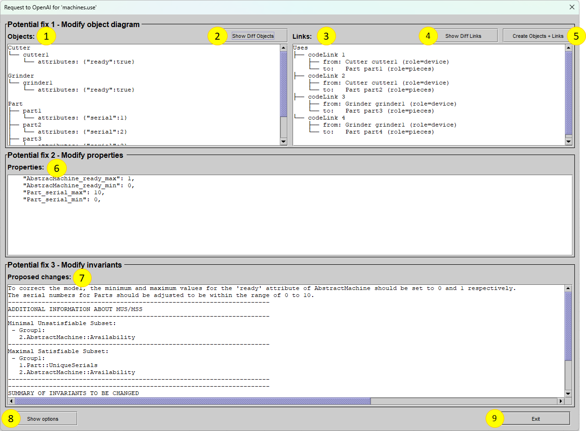

It basically has 3 blocks of suggestions:
- **Potential fix 1 – Modify object diagram**: Indicates the objects and links that should exist in the instance. If in the query we have provided a list of objects and links in the INPUTs block, it will make suggestions on how to modify them to improve the instance. If we haven't provided any lists, it will suggest creating a set of items to instantiate.
- **Potential fix 2 – Modify properties**: Proposes the modification of certain parameters contained in the model properties file (<ModelName>.properties).
- **Potential fix 2 – Modify invariants**: indicates the invariants that should be modified to improve the satisfiability of the model. If  we have not provided the MUS/MSS in the INPUTs block, it will calculate them and show them to us. 

Below, we detail the purpose of each graphic element.

[(Up)](#Table-of-Contents)

### 1: Objects

It shows the objects that it suggests to participate in the instance we intend to achieve by adding/removing those that may already exist previously or modifying the values it deems necessary. If there was no list of objects previously, it will suggest a new one.

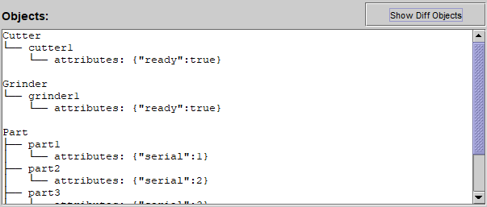

[(Up)](#Table-of-Contents)

### 2: Show Diff Objects

It shows the differences between the currently existing objects and those proposed in the new instance:

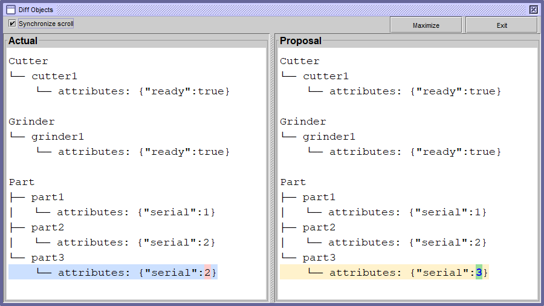

It has the following functionalities:

<table>
  <tr>
    <td>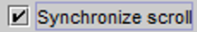</td>
    <td>Moving the scroll bar allows you to synchronize the 2 panels.</td>
  </tr>
  <tr>
    <td>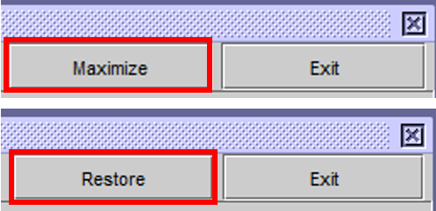</td>
    <td>
      This button changes its label when you press it and has 2 functionalities:
      <ul>
        <li><b>Maximize</b>: Expand the size of the dialogue so that it takes up the entire screen.</li>
        <li><b>Restore</b>: Restores to its initial size.</li>
      </ul>
    </td>
  </tr>
  <tr>
    <td>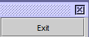</td>
    <td>Close the dialog box.</td>
  </tr>
</table>

[(Up)](#Table-of-Contents)

### 3: Links

Shows the links that it considers should exist in the instance. If links already existed previously, you can suggest modifying them. If they did not exist, it shall also propose the creation of those it deems appropriate.  

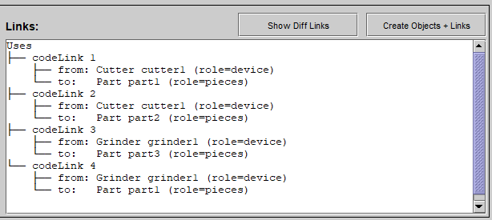

[(Up)](#Table-of-Contents)

### 4: Show Diff Links

It shows the differences between existing links and the proposed new ones.

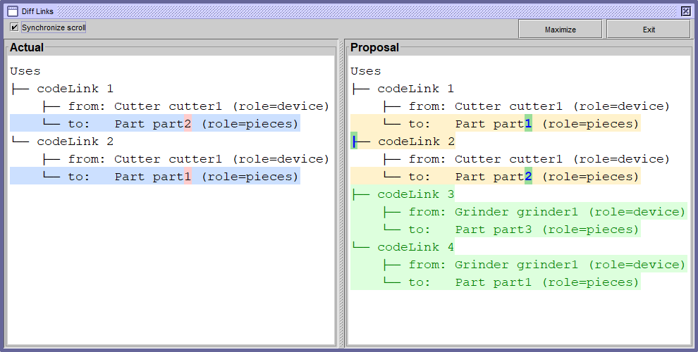

The **Synchronize scroll**, **Maximize**/**Restore**, and **Exit** graphics work the same as those discussed in the **Objects** section.

[(Up)](#Table-of-Contents)

### 5: Create Objects + Links

This button allows the creation of the proposed objects and links, but before its creation it shows a summary screen:

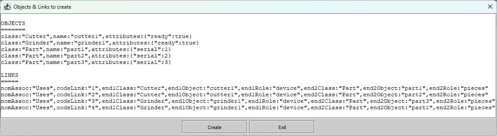

If we press **Exit**, we close the screen without taking any action. If we press **Create**, the instance is recreated using the list of proposed elements.

[(Up)](#Table-of-Contents)

### 6: Properties

Muestra los parámetros que sugiere modificar en el fichero **<nombreModelo>.properties** para facilitar la búsqueda de soluciones por parte del **Solver** utilizado en el cálculo de **MUS**/**MSS**.

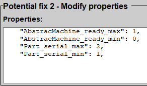

If you choose to modify this file, you have to reload the model to refresh its properties.

[(Up)](#Table-of-Contents)

### 7: Proposed changes

This Block shows textually the changes that should be made in the model and, especially, in the invariants it contains.

If we have not provided the MUS/MSS as INPUT in the query, OpenAI will calculate and display them here.

In the best of chaos, a table may be provided showing the current invariant (Original) and the proposal (Proposal):

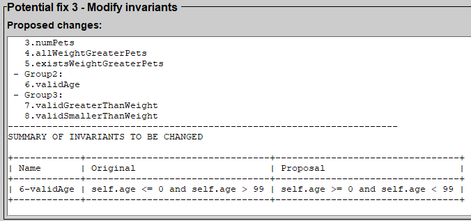

[(Up)](#Table-of-Contents)

### 8: Show options

This option is intended to help review the query and response blocks that occur during the call to **OpenAI**. It is an option more oriented to the debugging of the process than to its use, but sometimes, it can help to understand how the query was carried out internally.

When you click on this button, the following set of additional buttons appears:

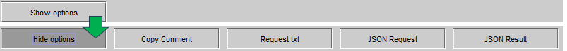

- **Copy Comment**: Allows you to copy the text that appears in the Proposed changes block to the clipboard. (See example in **ANNEXES**)
- **Request txt**: Copy on the clipboard, the query as it has been made to OpenAI (See example in **ANNEXES**)
- **JSON Request**: Copy query in JSON format. (See example in **ANNEXES**)
- **JSON Result**: Copies the result received from **OpenAI**. (See example in **ANNEXES**)

[(Up)](#Table-of-Contents)

### 9: Exit
Leave the dialogue without taking any action. 

[(Up)](#Table-of-Contents)

# ACKNOWLEDGMENT
Special thanks to ***Robert Clarisó*** for his invaluable help and perseverance and to ***Jordi Cabot*** for his many advices and very important suggestions.

[(Up)](#Table-of-Contents)

# CITATION

Juan Antonio Gómez-Gutiérrez, Robert Clarisó.
Interactive Repair in Conceptual Models Using LLM.
(to appear)

Juan Antonio Gómez-Gutiérrez, Robert Clarisó.
Interactive Repair of Inconsistencies in Conceptual Models. 
In Proc. 44th International Conference on Conceptual Modeling (ER'2025). Lecture Notes in Computer Science, Springer.

>https://link.springer.com/chapter/10.1007/978-3-032-08623-5_1

>**DOI: 10.1007/978-3-032-08623-5_1**

Juan Antonio Gómez-Gutiérrez, Robert Clarisó, Jordi Cabot.
A Tool for Debugging Unsatisfiable Integrity Constraints in UML/OCL Class Diagrams.
In Proc. 27th International Working Conference on Exploring Modeling Methods for Systems Analysis and Development (EMMSAD’2022). Lecture Notes in Business Information Processing vol. 450, pp. 267–275, Springer.

>https://link.springer.com/chapter/10.1007/978-3-031-07475-2_18

>**DOI: 10.1007/978-3-030-64846-6_6**

[(Up)](#Table-of-Contents)
   
# REFERENCES

* **Eclipse** - https://www.eclipse.org/downloads/
* **GitHub**  - https://desktop.github.com/
* **USE**     - https://github.com/useocl/use/

[(Up)](#Table-of-Contents)
